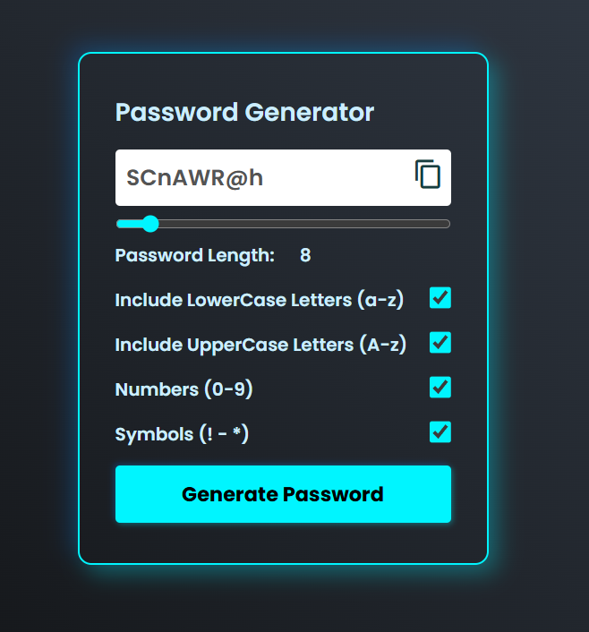
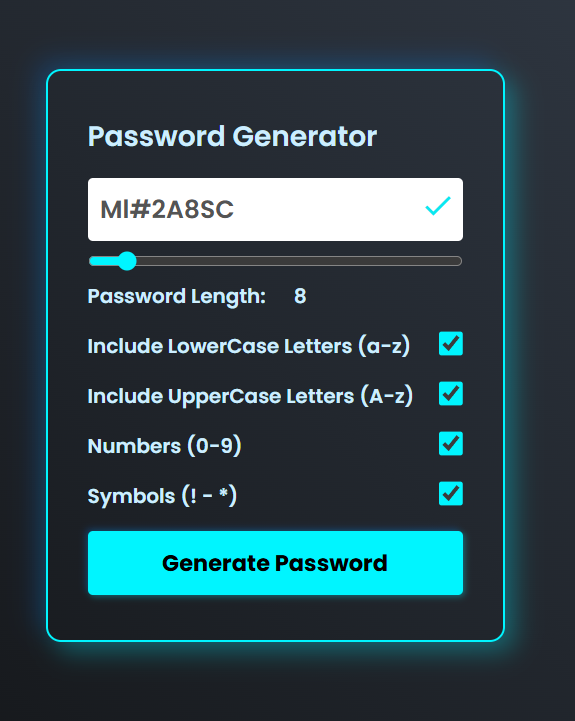

# Password Generator

A simple, customizable password generator built with **HTML, CSS, and JavaScript**.  
It allows users to generate secure passwords by choosing length and including lowercase letters, uppercase letters, numbers, and symbols.

---

## 🔗 Live Demo
[View Live Project](https://aryanbhardwaj4224.github.io/Password-Generator/)

---
## 🔑 Features
- Adjustable password length (6–30 characters)
- Option to include/exclude:
  - Lowercase letters
  - Uppercase letters
  - Numbers
  - Symbols
- One-click copy to clipboard
- Clean and responsive UI with modern styling

---

## 📸 Preview

### Password Generator Interface


### Generated Password Example


---

## 🛠 Tech Stack
- **HTML5** for structure  
- **CSS3** for styling (responsive & modern design)  
- **Vanilla JavaScript** for functionality  

---

## 🚀 Getting Started

### Clone the repository
```bash
git clone https://github.com/your-username/password-generator.git
cd password-generator
```
Simply open `index.html` in your preferred browser.

## 📂 Project Structure
```bash
password-generator/
│── index.html      # Main HTML structure
│── style.css       # Styling
│── script.js       # Functionality
│── prev-1.png      # Preview image 1
│── prev-2.png      # Preview image 2
```
## ✅ Future Improvements

- Add strength indicator for generated password

- Option to avoid similar characters (like O/0 or l/1)

- Dark/light mode toggle

- Save generated passwords to local storage


